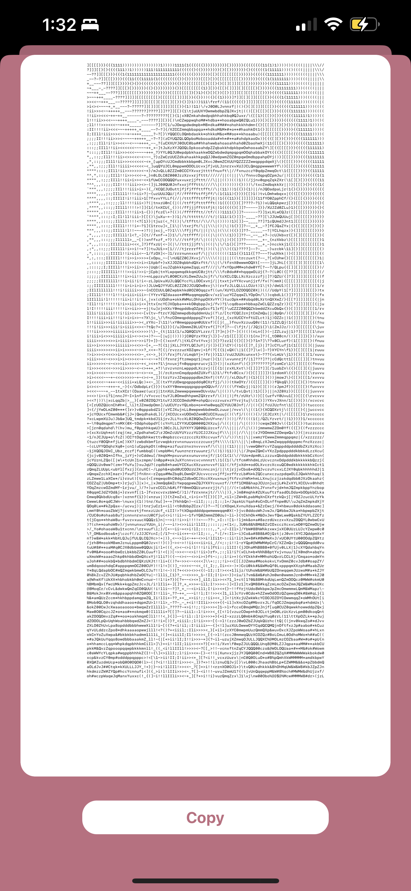

<!-- Improved compatibility of back to top link: See: https://github.com/othneildrew/Best-README-Template/pull/73 -->

<!--
*** Thanks for checking out the Best-README-Template. If you have a suggestion
*** that would make this better, please fork the repo and create a pull request
*** or simply open an issue with the tag "enhancement".
*** Don't forget to give the project a star!
*** Thanks again! Now go create something AMAZING! :D
-->

<!-- PROJECT SHIELDS -->
<!--
*** I'm using markdown "reference style" links for readability.
*** Reference links are enclosed in brackets [ ] instead of parentheses ( ).
*** See the bottom of this document for the declaration of the reference variables
*** for contributors-url, forks-url, etc. This is an optional, concise syntax you may use.
*** https://www.markdownguide.org/basic-syntax/#reference-style-links
-->
[![Contributors][contributors-shield]][contributors-url]
[![Forks][forks-shield]][forks-url]
[![Stargazers][stars-shield]][stars-url]
[![Issues][issues-shield]][issues-url]
[![LinkedIn][linkedin-shield]][linkedin-url]

<!-- PROJECT LOGO -->
 

  <a href="https://github.com/emcassi/ascii-art-ios">
   <!--  -->
  </a>

<h3 align="center">ASCII Art</h3>

  

    ASCII Art is an iOS app that lets you convert your photos to ascii art - photos made of <a href="https://en.wikipedia.org/wiki/ASCII">ASCII characters</a>
     
     
    <a href="https://github.com/emcassi/ascii-art-ios/issues">Report Bug</a>
    ·
    <a href="https://github.com/emcassi/ascii-art-ios/issues">Request Feature</a>
  

<!-- TABLE OF CONTENTS -->

  
Table of Contents

  <ol>
    <li>
      <a href="#about-the-project">About The Project</a>
      <ul>
        <li><a href="#built-with">Built With</a></li>
      </ul>
    </li>
    <li>
      <a href="#getting-started">Getting Started</a>
      <ul>
        <li><a href="#prerequisites">Prerequisites</a></li>
<!--         <li><a href="#installation">Installation</a></li> -->
      </ul>
    </li>
    <li><a href="#screenshots">Screenshots</a></li>
    
  </ol>

<!-- ABOUT THE PROJECT -->
## About The Project

(<a href="#readme-top">back to top</a>)

### Built With

* [![UIKit][UIKit]][UIKit-url]
* [![Swift][Swift]][Swift-url]
* [![SwiftImage][SwiftImage]][SwiftImage-url]

(<a href="#readme-top">back to top</a>)

<!-- GETTING STARTED -->

<!-- ## Installation

(<a href="#readme-top">back to top</a>)
 -->

<!-- Screenshots -->
## Screenshots

 

(<a href="#readme-top">back to top</a>)

<!-- CONTACT -->
## Contact

Alex Wayne - [@emcassi_](https://twitter.com/emcassi_) - alex.wayne.dev@gmail.com

Project Link: [https://github.com/emcassi/ascii-art-ios](https://github.com/emcassi/ascii-art-ios)

(<a href="#readme-top">back to top</a>)

<!-- MARKDOWN LINKS & IMAGES -->
<!-- https://www.markdownguide.org/basic-syntax/#reference-style-links -->
[contributors-shield]: https://img.shields.io/github/contributors/emcassi/ascii-art-ios.svg?style=for-the-badge
[contributors-url]: https://github.com/emcassi/ascii-art-ios/graphs/contributors
[forks-shield]: https://img.shields.io/github/forks/emcassi/ascii-art-ios.svg?style=for-the-badge
[forks-url]: https://github.com/emcassi/ascii-art-ios/network/members
[stars-shield]: https://img.shields.io/github/stars/emcassi/ascii-art-ios.svg?style=for-the-badge
[stars-url]: https://github.com/emcassi/ascii-art-ios/stargazers
[issues-shield]: https://img.shields.io/github/issues/emcassi/ascii-art-ios.svg?style=for-the-badge
[issues-url]: https://github.com/emcassi/ascii-art-ios/issues
[license-shield]: https://img.shields.io/github/license/emcassi/ascii-art-ios.svg?style=for-the-badge
[license-url]: https://github.com/emcassi/ascii-art-ios/blob/master/LICENSE.txt
[linkedin-shield]: https://img.shields.io/badge/-LinkedIn-black.svg?style=for-the-badge&logo=linkedin&colorB=555
[linkedin-url]: https://linkedin.com/in/alex-wayne-a1800a263
[product-screenshot]: images/screenshot.png

[UIKit]: https://img.shields.io/badge/uikit-fff?style=for-the-badge&logo=uikit
[Swift]: https://img.shields.io/badge/swift-fff?style=for-the-badge&logo=swift&logoColor=orange
[SwiftImage]: https://img.shields.io/badge/swift_image-1a73e8?style=for-the-badge

[UIKit-url]: https://developer.apple.com/documentation/uikit
[Swift-url]: https://developer.apple.com/swift
[SwiftImage-url]: https://github.com/koher/swift-image
